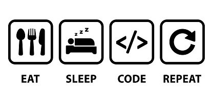

 <h3>A passionate frontend developer from BEC,  Thank You for taking the time to view my GitHub Profile! </h3>

  

<h2> About Me </h2>

- 🌱  **I’m currently a final year B.E student at Basaveshwar Engineering College.**
 
- 🌱 I’m currently learning **React & Android app development.**

- 👨‍💻 Check out my portfolio : [https://mayureshkumbar-portfolio-site.netlify.app/](https://mayureshkumbar-portfolio-site.netlify.app/)

- 📫 How to reach me : **mayurkumbar589@gmail.com**

<h3 align="left">Connect with me:</h3>

<h3 align="left">Languages and Tools:</h3>

         

